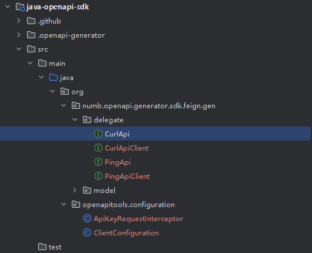
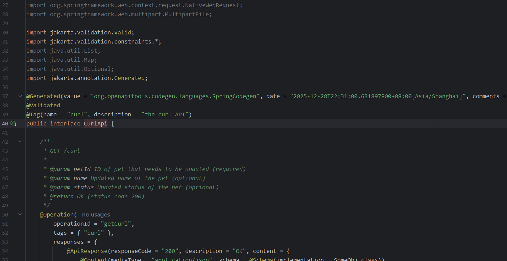
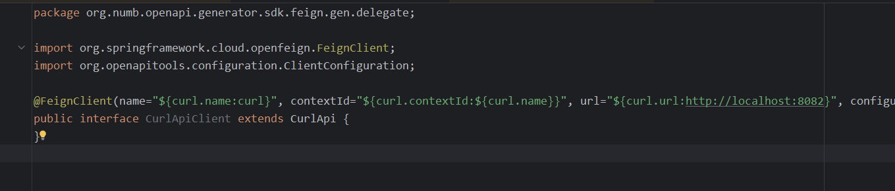
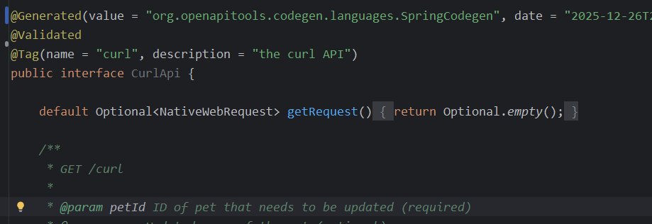
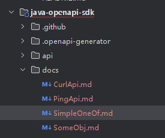
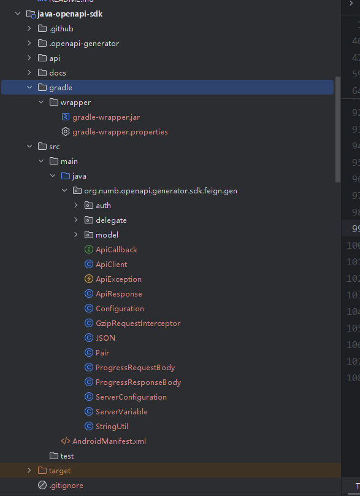

# 总览

以往web开发中，编写`controller`层的conVO对象代码占据了大量时间，如果我们能直接用接口yaml文件生成这些对象就好了，这样我们编写的yaml文件可以直接生成`controller`层以及VO对象，我们也可以把yaml文件直接提供给调用方，生成http客户端代码发起服务调用。本工程提供了利用`openapitools`利用yaml文件直接生成`controller`代码以及`httpclient`客户端，符合API-First开发理念。

# 什么是API-First开发理念

API-First（API 优先）是一种 **以 API 为核心驱动的软件开发模式**—— 在编写任何业务代码前，先设计、定义并冻结 API 规范（如 OpenAPI/Swagger 规范），再以该规范为 “契约”，同步推进前后端、跨语言（如 Java/C++）开发，最终所有模块通过统一 API 对接。

简单说：**先定 “接口契约”，再写代码**，而非传统 “先写后端代码，再凑接口文档，最后前端适配” 的模式。

# OpenAPITools介绍

OpenAPI Generator 能够根据 OpenAPI 规范（同时支持 2.0 和 3.0 版本），自动生成 API 客户端库（SDK 生成）、服务端桩代码（接口骨架）、文档及配置文件。[OpenAPITools主页](https://github.com/OpenAPITools/openapi-generator)

# OpenAPI Generator快速入门

本章节我们将演示如何通过一个swagger的yaml接口文件生成controller以及okhttp/feign等客户端代码。使用`jdk21`

项目已在github上开源

## 新建项目工程

项目工程结构如下：

```shell
|---java-openapi-generator
	|---pom.xm								# 父pom文件，定义三方件的依赖版本
	|---java-openapi-controller				# 服务端模块，生成controller层代码
		|---src/main/java					# 服务端代码
		|---src/main/resource				# 资源文件
			|---openapi
				|---v1
					|---openapi.yaml		# 接口yaml，用于生成服务端controller与客户端代码
	|---java-openapi-sdk					# 客户端模块，生成okhttp/feign等客户端代码
```

## 配置maven依赖

```xml
```

## 测试yaml文件

这里我们可以使用OpenAPI Generator样例中的yaml示例也可以使用自己已经写好的yaml，这里使用OpenAPI Generator样例中的`ping some object`示例并加tag为curl的相关方法

[OpenAPI Generator样例](https://github.com/OpenAPITools/openapi-generator/tree/master/samples/client/others/java/okhttp-gson-streaming/api)

```yaml
openapi: 3.0.1
info:
  title: ping some object
  version: "1.0"
servers:
  - url: http://localhost:8082/
tags:
  - ping
  - curl
paths:
  /ping:
    get:
      operationId: getPing
      parameters:
        - description: ID of pet that needs to be updated
          explode: true
          in: query
          name: petId
          required: true
          schema:
            format: int64
            type: integer
          style: form
      requestBody:
        content:
          application/x-www-form-urlencoded:
            schema:
              $ref: "#/components/schemas/getPing_request"
      responses:
        "200":
          content:
            application/json:
              schema:
                $ref: "#/components/schemas/SomeObj"
          description: OK
      tags:
        - ping
      x-streaming: true
      x-group-parameters: true
      x-content-type: application/x-www-form-urlencoded
      x-accepts:
        - application/json
    post:
      operationId: postPing
      requestBody:
        content:
          application/json:
            schema:
              $ref: "#/components/schemas/SomeObj"
      responses:
        "200":
          content:
            application/json:
              schema:
                $ref: "#/components/schemas/SomeObj"
          description: OK
      tags:
        - ping
      x-streaming: true
      x-content-type: application/json
      x-accepts:
        - application/json
  /curl:
    get:
      operationId: getCurl
      parameters:
        - description: ID of pet that needs to be updated
          explode: true
          in: query
          name: petId
          required: true
          schema:
            format: int64
            type: integer
          style: form
      requestBody:
        content:
          application/x-www-form-urlencoded:
            schema:
              $ref: "#/components/schemas/getCurl_request"
      responses:
        "200":
          content:
            application/json:
              schema:
                $ref: "#/components/schemas/SomeObj"
          description: OK
      tags:
        - curl
      x-streaming: true
      x-group-parameters: true
      x-content-type: application/x-www-form-urlencoded
      x-accepts:
        - application/json
    post:
      operationId: postCurl
      requestBody:
        content:
          application/json:
            schema:
              $ref: "#/components/schemas/SomeObj"
      responses:
        "200":
          content:
            application/json:
              schema:
                $ref: "#/components/schemas/SomeObj"
          description: OK
      tags:
        - ping
      x-streaming: true
      x-content-type: application/json
      x-accepts:
        - application/json
components:
  schemas:
    SomeObj:
      example:
        name: name
        active: true
        $_type: SomeObjIdentifier
        id: 0
        type: type
      properties:
        $_type:
          default: SomeObjIdentifier
          enum:
            - SomeObjIdentifier
          type: string
        id:
          format: int64
          type: integer
        name:
          type: string
        active:
          type: boolean
        type:
          type: string
      type: object
    SimpleOneOf:
      oneOf:
        - type: string
        - type: integer
    getPing_request:
      properties:
        name:
          description: Updated name of the pet
          type: string
        status:
          description: Updated status of the pet
          type: string
      type: object
    getCurl_request:
      properties:
        name:
          description: Updated name of the pet
          type: string
        status:
          description: Updated status of the pet
          type: string
      type: object


```

## 使用maven插件生成服务端代码

openapi-generator-maven-plugin官网指导

https://github.com/OpenAPITools/openapi-generator/blob/master/modules/openapi-generator-maven-plugin/README.md

工程中配置如下：使用`maven-clean-plugin`插件自动清理生成的文件，使用`openapi-generator-maven-plugin`生成服务端代码

```xml
<build>
    <plugins>
        <plugin>
            <groupId>org.apache.maven.plugins</groupId>
            <artifactId>maven-clean-plugin</artifactId>
            <configuration>
                <filesets>
                    <fileset>
                        <directory>${project.basedir}/src/main/java/org/org/numb/openapi/generator/gen</directory>
                    </fileset>
                </filesets>
            </configuration>
        </plugin>
        <plugin>
            <groupId>org.openapitools</groupId>
            <artifactId>openapi-generator-maven-plugin</artifactId>
            <!-- RELEASE_VERSION -->
            <version>${openapi-generator-maven-plugin.version}</version>
            <executions>
                <execution>
                    <id>generate-controller</id>
                    <phase>generate-resources</phase>
                    <goals>
                        <goal>generate</goal>
                    </goals>
                    <configuration>
                        <!-- 1. 关键配置：OpenAPI 规范文件（本地路径或 URL） -->
                        <inputSpec>${project.basedir}/src/main/resources/openapi/v1/openapi.yaml</inputSpec>
                        <!-- 或从远程 API 获取规范：<inputSpec>http://localhost:8080/v3/api-docs</inputSpec> -->

                        <!-- 2. 生成代码目标语言（必填，支持 50+ 语言，小写） -->
                        <!-- 常用语言：java、python、go、typescript-axios、php、csharp 等 -->
                        <generatorName>spring</generatorName>
                        <library>spring-boot</library>
                        <!-- 3. 输出目录（生成的代码存放位置，默认 src/main/java） -->
                        <output>${project.basedir}</output>
                        <!-- 4. 包配置（Java 语言专属，指定生成代码的包名） -->
                        <packageName>org.org.numb.openapi.generator.gen</packageName> <!-- 根包名 -->
                        <apiPackage>org.org.numb.openapi.generator.gen.delegate</apiPackage> <!-- API 操作类包名 -->
                        <modelPackage>org.org.numb.openapi.generator.gen.model</modelPackage> <!-- 数据模型包名 -->
                        <!-- 5. 额外配置（可选，根据语言自定义） -->
                        <generateModelTests>false</generateModelTests> <!-- 不生成模型测试代码 -->
                        <generateApiTests>false</generateApiTests> <!-- 不生成API测试代码 -->
                        <openapiGeneratorIgnoreList>pom.xml</openapiGeneratorIgnoreList>

                        <configOptions>
                            <interfaceOnly>true</interfaceOnly>
                            <dateLibrary>java21</dateLibrary> <!-- 日期处理用 Java8 LocalDate -->
                            <useJakartaEe>true</useJakartaEe> <!-- 是否使用 Jakarta EE（默认 false，用 Java EE） -->
                            <useBeanValidation>true</useBeanValidation>
                            <delegatePattern>true</delegatePattern>
                            <useSpringController>false</useSpringController>
                            <useOneOfInterfaces>true</useOneOfInterfaces>
                        </configOptions>
                        <!-- 6. 忽略已存在的文件（避免覆盖手动修改的代码，可选） -->
                        <ignoreFileOverride>${project.basedir}/</ignoreFileOverride>
                    </configuration>
                </execution>
            </executions>
        </plugin>
    </plugins>
</build>
```

#### configuration常用配置

- `inputSpec`：OpenAPI 规范文件（本地路径或 URL）
- `generatorName`：生成代码目标语言，当生成服务端代码时使用`spring`，`library`支持`spring-boot`、`spring-cloud`等标签
- `library`：服务端常用`spring-boot`、`spring-cloud`。`spring-boot`为生成controller代码，如果指定`spring-cloud`还会生成feign的客户端接口
- `output`：输出目录（生成的代码存放位置，默认 src/main/java）
- `packageName`：根包名配置（Java 语言专属，指定生成代码的包名）
- `apiPackage`：API 操作类包名
- `modelPackage`： 数据模型包名
- `generateModelTests`：不生成模型测试代码
- `generateApiTests`：不生成API测试代码
- `openapiGeneratorIgnoreList`：不生成的文件列表，这里可以配置pom.xml，让我们可以重新定义依赖组件的版本，不由openapi-tools控制

#### configOptions常用配置

- `interfaceOnly`: 只生成controller接口代码，不生成实现类
- `useJakartaEe`：是否使用 Jakarta EE（默认 false，用 Java EE），使用jdk17/jdk21与springboot3.x设置为true
- `useBeanValidation`：是否开启bean校验
- `delegatePattern`：是否使用代理模式生成服务端代码
- `useSpringController`：是否在生成的接口使用spring的`@Controller`注解，建议开启
- `useOneOfInterfaces`：用于控制是否生成oneOf互斥模型的接口，为true则只生成接口，否则会生成`hashcode`、`equals`等方法

spring服务端更多配置参考：

https://openapi-generator.tech/docs/generators/spring/#config-options

客户端配置与服务端配置不同，可根据生成代码需求按照generator类型分类查找

https://openapi-generator.tech/docs/generators/

## 使用maven插件生成客户端代码

### 生成spring-cloud-feign的客户端代码

这里为了保证服务端与客户端使用同一份yaml接口文件，在`java-openapi-sdk`工程中配置使用了`java-openapi-controller`的接口文件路径。工程中配置如下：使用`maven-clean-plugin`插件自动清理生成的文件，使用`openapi-generator-maven-plugin`生成服务端代码

其中关键配置为

- ` <generatorName>spring</generatorName>`
- `<library>spring-cloud</library>`

```xml
<build>
    <plugins>
        <plugin>
            <groupId>org.apache.maven.plugins</groupId>
            <artifactId>maven-clean-plugin</artifactId>
            <configuration>
                <filesets>
                    <fileset>
                        <directory>${project.basedir}/src/main/java/org/numb/openapi/generator/sdk/feign/gen</directory>
                    </fileset>
                </filesets>
            </configuration>
        </plugin>
        <plugin>
            <groupId>org.openapitools</groupId>
            <artifactId>openapi-generator-maven-plugin</artifactId>
            <!-- RELEASE_VERSION -->
            <version>${openapi-generator-maven-plugin.version}</version>
            <executions>
                <execution>
                    <id>generate-feign-sdk</id>
                    <phase>generate-resources</phase>
                    <goals>
                        <goal>generate</goal>
                    </goals>
                    <configuration>
                        <!-- 1. 关键配置：OpenAPI 规范文件（本地路径或 URL） -->
                        <inputSpec>${project.basedir}/../java-openapi-controller/src/main/resources/openapi/v1/openapi.yaml</inputSpec>
                        <!-- 或从远程 API 获取规范：<inputSpec>http://localhost:8080/v3/api-docs</inputSpec> -->

                        <!-- 2. 生成代码目标语言（必填，支持 50+ 语言，小写） -->
                        <!-- 常用语言：java、python、go、typescript-axios、php、csharp 等 -->
                        <generatorName>spring</generatorName>
                        <library>spring-cloud</library>
                        <!-- 3. 输出目录（生成的代码存放位置，默认 src/main/java） -->
                        <output>${project.basedir}</output>
                        <!-- 4. 包配置（Java 语言专属，指定生成代码的包名） -->
                        <packageName>org.numb.openapi.generator.sdk.feign.gen</packageName> <!-- 根包名 -->
                        <apiPackage>org.numb.openapi.generator.sdk.feign.gen.delegate</apiPackage> <!-- API 操作类包名 -->
                        <modelPackage>org.numb.openapi.generator.sdk.feign.gen.model</modelPackage> <!-- 数据模型包名 -->
                        <!-- 5. 额外配置（可选，根据语言自定义） -->
                        <generateModelTests>false</generateModelTests> <!-- 不生成模型测试代码 -->
                        <generateApiTests>false</generateApiTests> <!-- 不生成API测试代码 -->
                        <generateSupportingFiles>true</generateSupportingFiles>
                        <openapiGeneratorIgnoreList>pom.xml</openapiGeneratorIgnoreList>
                        <configOptions>
                            <interfaceOnly>false</interfaceOnly>
                            <sourceFolder>src/main/java</sourceFolder> <!-- 生成代码的源码目录 -->
                            <dateLibrary>java8</dateLibrary> <!-- 日期处理用 Java8 LocalDate -->
                            <useJakartaEe>true</useJakartaEe> <!-- 是否使用 Jakarta EE（默认 false，用 Java EE） -->
                            <useBeanValidation>true</useBeanValidation>
                            <serializationLibrary>jackson</serializationLibrary>
                            <generateClientAsBean>true</generateClientAsBean>
                            <library>spring-cloud</library>
                        </configOptions>
                    </configuration>
                </execution>
            </executions>
        </plugin>
    </plugins>
</build>
```

#### configuration常用配置

- `inputSpec`：OpenAPI 规范文件（本地路径或 URL）
- `generatorName`：生成代码目标语言，当生成spingcloudfeign客户端代码时使用`spring`，`library`必须固定为`spring-cloud`
- `library`：固定为`spring-cloud`
- `output`：输出目录（生成的代码存放位置，默认 src/main/java）
- `packageName`：根包名配置（Java 语言专属，指定生成代码的包名）
- `apiPackage`：API 操作类包名
- `modelPackage`： 数据模型包名
- `generateModelTests`：不生成模型测试代码
- `generateApiTests`：不生成API测试代码
- `openapiGeneratorIgnoreList`：不生成的文件列表，这里可以配置pom.xml，让我们可以重新定义依赖组件的版本，不由openapi-tools控制
- `generateApiDocumentation`：是否在`docs`目录下生成 API 接口相关文档
- `generateModelDocumentation`：生成`docs`目录下数据模型相关文档
- `generateSupportingFiles`：生成工程支撑文件，默认开启会生成一个配置类

#### configOptions常用配置

- `interfaceOnly`: 只生成接口代码，不生成实现类，建议false
- `useJakartaEe`：是否使用 Jakarta EE（默认 false，用 Java EE），使用jdk17/jdk21与springboot3.x设置为true
- `useBeanValidation`：是否开启bean校验
- `delegatePattern`：是否使用代理模式生成服务端代码

生成效果如下：








# OpenAPI Generator进阶使用


# FAQ

## Q1：为什么生成的Controller接口中没有@Controller注解



建议排查配置项`configOptions`的`useSpringController`是否为`true`

```xml
<groupId>org.openapitools</groupId>
<artifactId>openapi-generator-maven-plugin</artifactId>
<version>${openapi-generator-maven-plugin.version}</version>
<executions>
    <execution>
        <!--其他配置...-->
        <configuration>
            <!--其他配置...-->
         	<generateApiDocumentation>false</generateApiDocumentation>
         	<generateModelDocumentation>false</generateModelDocumentation>
         	<generateSupportingFiles>false</generateSupportingFiles>
            <configOptions>
                <useSpringController>false</useSpringController>
            </configOptions>
        </configuration>
    </execution>
</executions>
```

## Q2：服务端代码生成时如何防止pom文件被覆盖

可以配置`openapiGeneratorIgnoreList`为`pom.xml`防止覆盖

```xml
<groupId>org.openapitools</groupId>
<artifactId>openapi-generator-maven-plugin</artifactId>
<version>${openapi-generator-maven-plugin.version}</version>
<executions>
    <execution>
        <!--其他配置...-->
        <configuration>
            <!--其他配置...-->
            <openapiGeneratorIgnoreList>pom.xml</openapiGeneratorIgnoreList>
            <configOptions>
            	<!--其他配置...-->
            </configOptions>
        </configuration>
    </execution>
</executions>
```


## Q3：客户端代码生成时禁用API文档生成

在客户端代码生成时同步生成了api接口文档，如何禁用？



建议排查配置项`configuration`的`generateApiDocumentation`是否为`false`。如何不想生成任何文档，建议将`generateApiDocumentation`,`generateModelDocumentation`都设置为false

- `generateApiDocumentation`：是否生成 API 接口相关文档
- `generateModelDocumentation`：生成数据模型相关文档

```xml
<groupId>org.openapitools</groupId>
<artifactId>openapi-generator-maven-plugin</artifactId>
<version>${openapi-generator-maven-plugin.version}</version>
<executions>
    <execution>
        <!--其他配置...-->
        <configuration>
            <!--其他配置...-->
         	<generateApiDocumentation>false</generateApiDocumentation>
         	<generateModelDocumentation>false</generateModelDocumentation>
            <configOptions>
            <!--其他配置...-->
            </configOptions>
        </configuration>
        </configuration>
    </execution>
</executions>
```

## Q4：客户端代码生成时禁用Gradle等生成

使用maven构建时，默认生成了gradle的配置文件



建议排查配置项`configuration`的`generateSupportingFiles`设置为false，但是需要自己手动补全一些文件如`ApiClient`等

```xml
<groupId>org.openapitools</groupId>
<artifactId>openapi-generator-maven-plugin</artifactId>
<version>${openapi-generator-maven-plugin.version}</version>
<executions>
    <execution>
        <!--其他配置...-->
        <configuration>
            <!--其他配置...-->
         	<generateSupportingFiles>false</generateSupportingFiles>
            <configOptions>
            <!--其他配置...-->
            </configOptions>
        </configuration>
        </configuration>
    </execution>
</executions>
```

